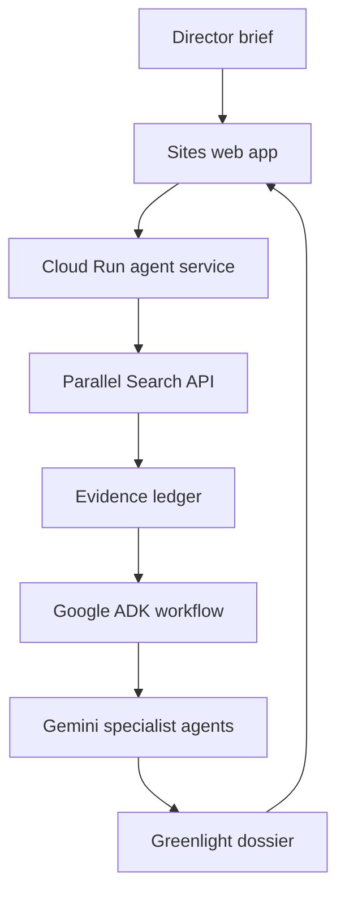

# CINEOPS // RESONANCE

**Autonomous Creative & Production Intelligence for Film**

CINEOPS turns a director's brief into a grounded, production-ready creative dossier. It combines live web intelligence from Parallel Search with a deterministic Google Agent Development Kit workflow powered by Gemini.

[Open the live experience](https://cineops-resonance.samysalamy.chatgpt.site)

> The hosted UI is public and works in transparent demo mode until its Cloud Run agent endpoint is configured. Demo mode is labeled in-product and never presents sample content as a live API result.

## Why it exists

Early film development is fragmented across moodboards, research tabs, treatments, feasibility notes and disconnected AI chats. CINEOPS creates one traceable decision system: every narrative, production, visual and sonic recommendation is synthesized against a shared brief and a source ledger.

## Runtime architecture



The AI runtime is isolated in Google Cloud Run because Google ADK is a Node server framework. The public web worker only validates input, proxies the request and renders the resulting dossier. API keys remain server-side.

## Agent workflow

| Stage | Runtime | Responsibility |
|---|---|---|
| Brief Director | Gemini + ADK | Audience promise, dramatic question and non-negotiables |
| Live Intelligence | Parallel Search API | Current evidence, excerpts and traceable URLs |
| Narrative Architect | Gemini + ADK | Thesis, tension curve and symbolic spine |
| Production Planner | Gemini + ADK | Scope, schedule, risks and feasibility |
| Sonic + Visual Director | Gemini + ADK | Camera, light, color, motif, BPM and sound arc |
| Greenlight Synthesis | Gemini + ADK | One validated production dossier |

The Narrative, Production and Sonic + Visual agents execute concurrently through ADK's `ParallelAgent`. ADK's `SequentialAgent` guarantees that brief interpretation happens first and synthesis happens last.

## Built with

- [`@google/adk`](https://www.npmjs.com/package/@google/adk) for multi-agent orchestration
- [Gemini](https://ai.google.dev/gemini-api/docs) through Google's official Gen AI SDK
- [`parallel-web`](https://www.npmjs.com/package/parallel-web) for a real runtime call to the [Parallel Search API](https://docs.parallel.ai/search/search-quickstart)
- TypeScript, React, Vinext and a Cloudflare-compatible Sites worker for the experience layer
- Google Cloud Run for the agent service

No other AI provider is used.

## Repository layout

```text
app/                    Web experience and same-origin API proxy
agent-service/          Google ADK + Gemini + Parallel Cloud Run service
lib/contracts.ts        Shared web response contract and transparent demo data
docs/                   Submission checklist and three-minute demo script
```

## Run the web experience

Requirements: Node.js 24 and npm.

```bash
npm ci
npm run dev
```

Without `CINEOPS_AGENT_URL`, the web experience intentionally returns its labeled demo dossier.

## Run the agent service

```bash
npm --prefix agent-service ci
npm --prefix agent-service run build
GEMINI_API_KEY=... \
PARALLEL_API_KEY=... \
CINEOPS_SHARED_SECRET=... \
npm --prefix agent-service start
```

Environment variables:

| Variable | Location | Required | Purpose |
|---|---|---:|---|
| `GEMINI_API_KEY` | Agent service | Yes | Gemini model access |
| `PARALLEL_API_KEY` | Agent service | Yes | Parallel Search runtime access |
| `GEMINI_MODEL` | Agent service | No | Defaults to `gemini-2.5-flash` |
| `CINEOPS_SHARED_SECRET` | Agent service | Recommended | Authenticates proxy requests |
| `CINEOPS_AGENT_URL` | Web runtime | Yes for live mode | Cloud Run service base URL |
| `CINEOPS_AGENT_TOKEN` | Web runtime | Recommended | Must match the shared secret |

Never commit `.env` files or secrets. The repository ignores all `.env*` files.

## Deploy the agent to Google Cloud Run

Create a new Gemini auth key in Google AI Studio and a Parallel API key. Then open Google Cloud Shell, clone this repository and run the protected deployment helper from the repository root:

```bash
bash scripts/deploy-cloud-run.sh YOUR_GOOGLE_CLOUD_PROJECT_ID
```

The helper enables the required services, stores all credentials in Secret Manager, deploys with a one-instance cost ceiling, verifies `/health`, and writes the two private Sites values to a restricted temporary file. Set those values as `CINEOPS_AGENT_URL` and `CINEOPS_AGENT_TOKEN` in the web runtime, then redeploy the web experience.

## API contract

`POST /api/pipeline`

```json
{
  "brief": "A four-minute audiovisual piece about people transforming inherited systems...",
  "constraints": {
    "format": "music-film",
    "duration": "4m",
    "scale": "lean"
  }
}
```

The response reports `mode: "live"` only after the Cloud Run service has completed a Parallel Search call and the Gemini ADK workflow. Otherwise the UI reports `mode: "demo"` and names the missing server configuration.

## Verification

```bash
npm run lint
npm --prefix agent-service run typecheck
npm --prefix agent-service run build
```

## Hackathon compliance

CINEOPS is a new project for [Agentic Cinema: The Blockbuster Hackathon](https://agentic-cinema.devpost.com/), targeting the [Parallel track](https://agentic-cinema.devpost.com/details/parallel-resources). The source includes the actual runtime imports and calls for Google ADK, Gemini and Parallel Search—not only README references. See the [submission checklist](docs/SUBMISSION_CHECKLIST.md) for the remaining release gates.

## License

[MIT](LICENSE)
